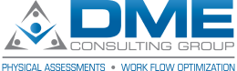

# DME-CG



# Dev

## Local dev

### Database
Before doing anything create the mysql database with something like
```bash
mysql -uUSER -p -e"create database dme";
```

### Configs

in the root of the project copy the .env.example to .env then set your ipaddress on API_HOST
```bash
cd apps/backend
cp .env.example .env
```

In the api directory copy the .env.example to .env
 
    This step might seem duplicate but it helps to have the .env file in this directory in case you want to run the api 
    without the root directories yarn package.json scripts.
     
```bash
cd apps/backend
cp .env.example .env
``` 
Set your configs in there. You should only need to update the mysql ones.

Generate the IDE key
```bash
cd apps/backend
php artisan key:generate --ansi
``` 

### install
* run `yarn install` I've added a postinstall hook to do everything else.

### start the queueing server, web api server, and the app
* run `yarn start`

Yarn start does a few things. It will also open xterm and run yarn start in the app directory
xterm should exist on macs and linux systems but might break in windows. 

### apps/mobile

## Useful Links
* https://github.com/JosephSilber/bouncer
* https://github.com/VentureCraft/revisionable
* https://yarnpkg.com/advanced/lifecycle-scripts
* [Laravel bouncer - roles and permissions](https://github.com/JosephSilber/bouncer#cheat-sheet)

## Quick tips 

If you see errors that say something like "not enough watchers" clear it with `yarn watchman:reset` should work in most cases.

### System resources
In your IDE ignore these directories, they are compiled and are not useful to the IDE
* apps/mobile/.expo
* apps/backend/public
